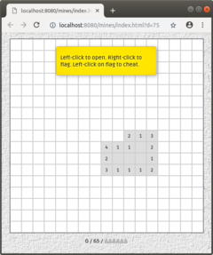
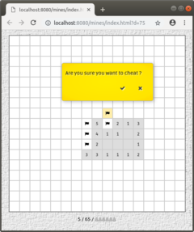

## Introduction ##
This is a typescript implementation of the mines game, written from scratch. It can be served using the builtin node-js server, or any web server:
```
    $ node out/server.js &
    # Listening on port 8080 ...
```
Start the game at your browser with `http://localhost:8080/mines/index.html?c=28&d=50`. The `c` parameter specify the cell size in px, default is 28. The `d` parameter specify the difficulty in range 0..100, default is 50.

[](screenshots/mines-01.png) [](screenshots/mines-02.png)

## Build instruction ##
First of all, pull dependencies with:
```
    npm install --save-dev
```
Open the project in VSCode. Make sure the `bot-tsc` task is the default build task, the `bot-runner` task is the default test task and you have `tsc 3.8` or later. Run the build task to build. To package the JS files, you need `browserify` and `uglify-js`. Select the function name `pack` in `builder.ts` and run the `bot-runner` test task to create a ready to run distribution in the `mines/` directory. In VSCode, you may launch the `server` program in the `Run` panel or with `F5`.

## License ##
Released under Apache License 2.0. See [`LICENSE`](LICENSE).

The project use FontAwesome and Ruda-Regular fonts that are distributed under [`http://scripts.sil.org/OFL`](OFL.txt).
